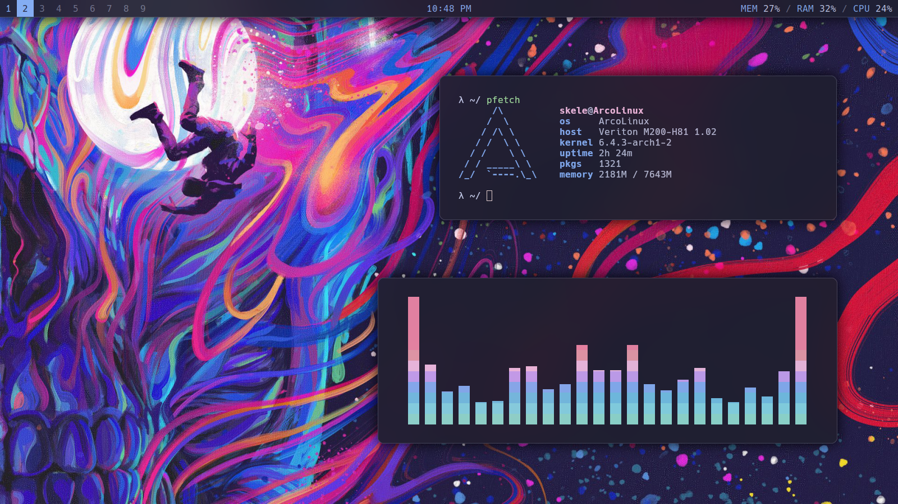

# Application
- **Window Manager:** [Bspwm](https://github.com/baskerville/bspwm/)
- **Shell:** [Zsh](https://zsh.sourceforge.io/) / [Oh My Zsh](https://github.com/ohmyzsh/ohmyzsh)
- **Terminal:** [Kitty](https://github.com/kovidgoyal/kitty)
- **Bar:** [Polybar](https://github.com/polybar/polybar)
- **Theme:** [Catppuccin](https://github.com/catppuccin/catppuccin)
- **Wallpaper Setter:** [Feh](https://github.com/derf/feh)
- **Compositor:** [Picom](https://github.com/yshui/picom/)
- **File Manager:** [Thunar](https://gitlab.xfce.org/xfce/thunar)
- **Browser:** [Firefox](https://www.mozilla.org/en-US/firefox/)
- **Launcher:** [Rofi](https://github.com/davatorium/rofi)
- **Audio Visualizer:** [Cava](https://github.com/karlstav/cava)
- **Font:** [Hack](https://sourcefoundry.org/hack/)

# Installation

## Automatic
- Work in progress...

## Manual
- Clone this repository
- Copy all the files to `$HOME/.config/bspwm` folder
- Enjoy!

# Inspiration
- [Erik Dubois](https://github.com/erikdubois/)
- [Aditya Shakya](https://github.com/adi1090x)
